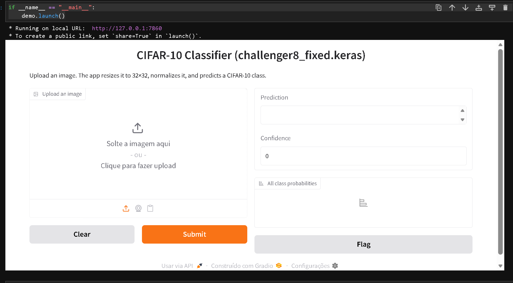

# Project I | Deep Learning: Image Classification with CNN

# Image Classification with CNN

Build a Convolutional Neural Network (CNN) model to classify images from a given dataset into predefined categories/classes.

[Task Descriptions and Project Instructions](https://github.com/ironhack-labs/project-1-deep-learning-image-classification-with-cnn)

## Project Results 
In this project, we processed the CIFAR10 dataset of images and explored different classifiers results:
- Building a sequential CNN model from scratch
- Fine tuned the model and got 84 % of accuracy and 0.47 of loss
- Transfer learning from VGG19 that got us 85 % of accuracy and 0.5 of loss with only 2 unfrozen layers

We deployed a simple gradio demo showing the classification results on unseen images.

## Repository Folders and Files

Here is a short description of the folder and files available on the repository.

### Documents
**Group 4 - Image Classification with CNN - Presentation Slides**  
Presentation_P1_G4 

### Saved models 

We didn't save all of the models because they were already inferior than the ones we had previously - The winner model is `challenger8_fixed.keras` or `challenger8.pkl`

- **challenger1.pkl**:saved model
- **challenger2.pkl**:saved model
- **challenger3.pkl**:saved model
- **challenger6.pkl**:saved model
- **challenger7.pkl**:saved model
- **challenger8.pkl**:saved model
- **challenger8_fixed.keras**:saved model
- **model_02.keras**:saved model
- **model_03.keras**:saved model
- **model_04.keras**:saved model
- **model_05.keras**:saved model
- **model_06.keras**:saved model
- **model_07.keras**:saved model
- **model_08.keras**:saved model

### Notebooks  
- **Workflow_Project1_CIFAR10_CNN_G4**: Our workflow where we worked to obtain eacg model

- **Baseline_ID1**: Training a baseline CNN from scratch
- **challenger_ID2**: Baseline + 1 CV 32 + Dropout
- **challenger_ID4**: challenger_ID2 + 2 CV 32 + GlobalPooling2D 
- **challenger_ID5**: 2 CV 64 + Dense 256 + GlobalPooling2D
- **challenger_ID6**: 4 CV 64 + Dense 128 + GlobalPooling2D
- **challenger_ID7**: 3 CV 64 + Dense 128 + GlobalPooling2D
- **challenger_ID8**: Challenger_ID4 + Padding + 64 on the middle layers 
- **challenger_ID9**: Conv64x2 + Conv128x2 + BatchNormalization + GlobalPooling2D
- **challenger_ID10**: challenger_ID8 + TopKAccuracy
- **challenger_ID11**: challenger_ID10 + SGD + LR=0,05
- **challenger_ID12**: Conv64x2 + Conv128x2 + BatchNormalization + GlobalPooling2D + SGD+LR=0,05
- **challenger_ID13**: challenger_ID11 + Adding 64x2 + 128x2 batch 512¶
- **challenger_ID14**: challenger_ID13 + Padding at the start + batch 512 + 80 epochs
- **challenger_ID14_1**: challenger_ID13+ Padding at the start + batch 128 + reduce ron plateau + 80 epochs
- **challenger_ID15**: challenger_ID14_1 + data augmentation horizontal flips = (0,1 , 0,1)
- **challenger_ID16**: challenger_ID14_1 + data augmentation horizontal flips = (0,025 , 0,025)
- **challenger_ID17**: challenger_ID14_1 + data augmentation horizontal flips = (0,1 , 0,1)
- **challenger_ID18**: challenger_ID14_1 + deeper CNN + BN + augmentation + SGD (lr=0.1) + batch 256 + 150 epochs
- **challenger_IDVGG19**: Transfer of vgg19, freeze and unfreeze the last 2 columns

- **Deployment**: Deploy a demo of our best model on Gradio

### Python Modules

**deployment.py:** A .py to call deployment from terminal if we want.

